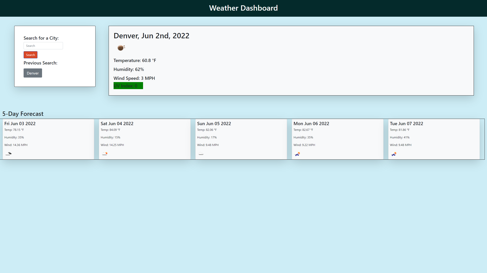

# Weather-app

This project is an example of a weather app that uses the openWeather API to retrieve weather data from cities around the world.
Methonds used in this app include HTML, JavaScript, CSS, Third Party API implementation, Fetch requests, Setting JSON objects in local storage, bootstrap, and many more.

## Requirements:

GIVEN a weather dashboard with form inputs
WHEN I search for a city
THEN I am presented with current and future conditions for that city and that city is added to the search history
WHEN I view current weather conditions for that city
THEN I am presented with the city name, the date, an icon representation of weather conditions, the temperature, the humidity, the wind speed, and the UV index
WHEN I view the UV index
THEN I am presented with a color that indicates whether the conditions are favorable, moderate, or severe
WHEN I view future weather conditions for that city
THEN I am presented with a 5-day forecast that displays the date, an icon representation of weather conditions, the temperature, the wind speed, and the humidity
WHEN I click on a city in the search history
THEN I am again presented with current and future conditions for that city

## Usage:

To use the application, the user must simply provide the name of a city in the search box, and click search. The app will then dynamically display the infromation required under the acceptance criteria. If the user wishes to look at the previously searched city, there will be a button below the search area that the user may click to search for the weather of that city. 

## Challenges in development:

What I struggled with the most with this challenge was the creation of the 5 day forecast divs. I was at first, unable to style the cards in the way that I wanted to. I was unfamiliar with giving bootstrap classes with javaScript, and that took some time to learn. I found that using query selectors, with .classList afterwards, was not working. I had to make seperate lines, using the variable name that was created with the query selector. I was also unable to append more than one city into the search history. I believe this is because when the search button is pressed, the localStorage information is overwritten. I am not sure how to fix that, but I know with some more time, I would be able to figure it out. 

## Screenshot

## GitHub Link

https://github.com/brandonelliott0530/Weather-app

## Link to Deployed Code

https://brandonelliott0530.github.io/Weather-app/

## Contact Me:
Email: brandonelliott0594@gmail.com
GitHub: https://github.com/brandonelliott0530